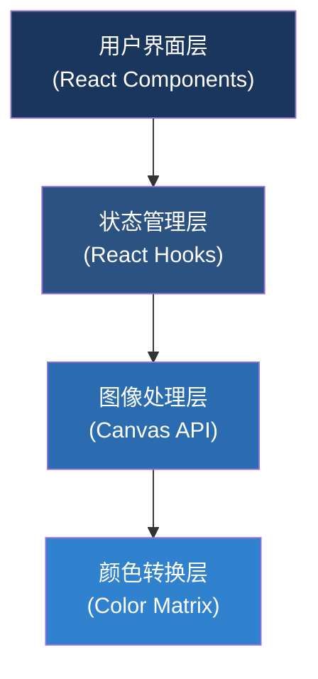

## 1. 架构设计

本项目为纯前端应用，采用React + TypeScript构建，所有图像处理在浏览器端完成，无需后端服务。



## 2. 技术描述

- **前端框架**：React@18 + TypeScript
- **构建工具**：Vite@5
- **样式方案**：TailwindCSS@3 + CSS变量
- **图像处理**：HTML5 Canvas API + ImageData
- **图标库**：Lucide React
- **无需后端**：所有计算在浏览器端完成，保护用户隐私

## 3. 核心技术点

### 3.1 颜色矩阵转换

使用标准的色盲模拟矩阵，基于RGB颜色空间进行线性变换：

| 色盲类型 | 矩阵说明 |
|-----------|----------|
| Protanopia（红色盲） | 红色视锥细胞缺失，混淆红绿色 |
| Deuteranopia（绿色盲） | 绿色视锥细胞缺失，最常见的色盲类型 |
| Tritanopia（蓝黄色盲） | 蓝色视锥细胞缺失，混淆蓝黄色 |
| Achromatopsia（全色盲） | 只能看到灰度，无色彩感知 |
| Protanomaly（红色弱） | 红色视锥细胞异常 |
| Deuteranomaly（绿色弱） | 绿色视锥细胞异常 |

### 3.2 Canvas双缓冲技术

使用两个Canvas元素：
- 原图画布：存储原始图像数据
- 模拟图画布：应用颜色矩阵后显示结果

## 4. 目录结构

```
src/
├── components/
│   ├── ImageUploader.tsx      # 图片上传组件
│   ├── ColorblindSelector.tsx # 色盲类型选择器
│   ├── CanvasPreview.tsx      # Canvas预览组件
│   ├── SplitCompare.tsx       # 分屏对比组件
│   └── Toolbar.tsx            # 工具栏组件
├── hooks/
│   ├── useImageProcessor.ts   # 图像处理Hook
│   └── useColorMatrix.ts      # 颜色矩阵Hook
├── utils/
│   ├── colorMatrix.ts         # 颜色矩阵定义
│   └── imageUtils.ts          # 图像处理工具
├── types/
│   └── index.ts               # 类型定义
├── App.tsx
├── main.tsx
└── index.css
```

## 5. 类型定义

```typescript
// 色盲类型
type ColorblindType = 
  | 'normal'
  | 'protanopia'
  | 'deuteranopia'
  | 'tritanopia'
  | 'achromatopsia'
  | 'protanomaly'
  | 'deuteranomaly';

// 颜色矩阵 (3x3)
type ColorMatrix = [
  [number, number, number],
  [number, number, number],
  [number, number, number]
];

// 图片状态
interface ImageState {
  file: File | null;
  url: string | null;
  originalData: ImageData | null;
  processedData: ImageData | null;
}
```

## 6. 性能优化

- **Web Worker**：大图片处理使用Web Worker避免阻塞主线程
- **离屏Canvas**：使用OffscreenCanvas进行后台渲染
- **缓存机制**：已处理的色盲类型结果缓存，切换时无需重新计算
- **增量更新**：分割线拖动时使用CSS裁剪而非重绘Canvas

## 7. 路由定义

| 路由 | 用途 |
|-------|---------|
| / | 主应用页面，包含所有功能 |
